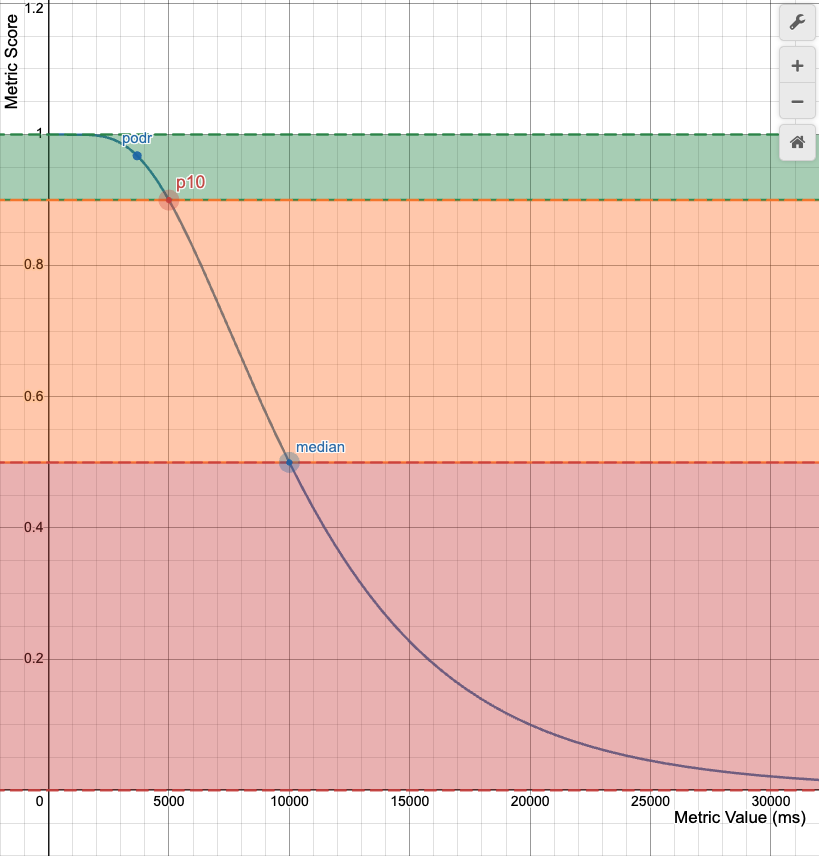

The **Performance Score** is a _weighted average_ of the Metric Scores.

$$
\text{Performance Score} = \sum_{i} weight_{i} \cdot \text{Metric Score}_{i}
$$

where $\sum_{i} w_{i}= 1$

## Metric Scores

Once Lighthouse has gathered the performance metrics (mostly reported in milliseconds), it converts each raw metric value into a metric score from 0 to 100 by looking where the metric value falls on its Lighthouse Scoring Distribution (aka Individual Metric Curve).

If $x$ is the raw metric expressed in milliseconds, then its related $\text{Metric Score}$ is equals to $\text{Scoring Distribution}(x)$, where the **Scoring Distribution** is a log-normal distribution that defines a metric cure similar to the following one:

In the metric curve we have two control points:

1. Median Control Point (Metric Score = 50): corresponds to the 25th percentile of HTTPArchive data.
2. p10 (Metric Score = 90): corresponds to the 10th percentile of HTTPArchive data.

The **podr** (i.e. "point of diminishing returns") is a point, between 0.50 and 0.92, in which the scoring curve has a near-linear relationship between metric value and score. Scores above the "point of diminishing returns" requires an increasingly more metric improvement to improve an already high score.

## How scores are color-coded

The Metrics Scores, and the Performance Score, are colored according to these ranges:

- 0 to 49 (red): Poor
- 50 to 89 (orange): Needs Improvement
- 90 to 100 (green): Good

To provide a good user experience, sites should strive to have a good score (90-100). A "perfect" score of 100 is extremely challenging to achieve and not expected. 

## References

- [Chrome for Developers - Lighthouse performance scoring](https://developer.chrome.com/docs/lighthouse/performance/performance-scoring/)
- [Performance Scoring](https://web.dev/performance-scoring/)
- [lh-scorecalc](https://paulirish.github.io/lh-scorecalc/)
- [Metric Score demo](https://www.desmos.com/calculator/o98tbeyt1t)

