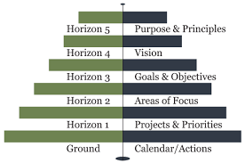

#second-brain 

## 🙂 H5 - Purpose & Principles (life)

> The purpose, mission, and values at the heart of your existence.

## 🔭 H4 - Vision (5y)

> A broad overview of what success looks like for you on a 3 – 5 years timeline.

## 🥅 H3 - Goals & Objectives (2y)

> The larger outcomes you’d like to make manifest in the next 1 – 2 years.

## 🔥 H2 - Area of Focus (1y)

> Areas of Focus and Accountabilities.
> The roles and areas of life you are committed to focusing on in the next 12 months.

## ⚡️ H1 - Projects & Priorities (3mo)

> The list of any outcome you are committed to realizing in < 12 months.
> Personally, for this horizon, I prefer defining activities that can be done in a quarter (i.e. \<= 3 months).

Refer to [[PARA Method]].

## ⬅️ Ground - Calendar/Actions

> Ground tasks are the one you execute everyday

Refer to [[GTD Framework]] or [[Now-Next-Later Roadmap]].
