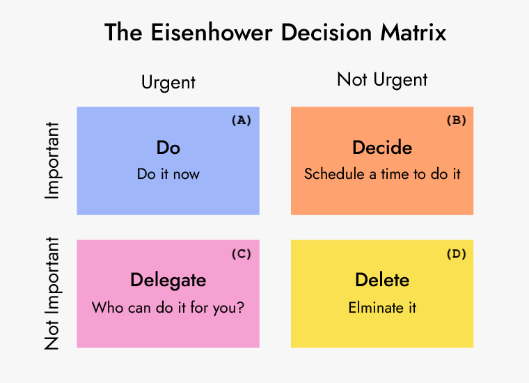

#second-brain

The Eisenhower Decision Matrix, also known as the Eisenhower Matrix or the Urgent-Important Matrix, is a productivity tool that helps individuals prioritize tasks and make effective decisions about how to allocate their time and energy.

The matrix categorizes tasks based on two dimensions: urgency and importance. It creates a visual representation of tasks in a four-quadrant grid: `(A)`, `(B)`, `(C)`, `(D)`.

- `(A)`: _Urgent and Important_ Tasks
These tasks require immediate attention and have significant consequences if not completed. They are often deadline-driven or involve critical issues. Examples include important work deadlines, emergencies, or health-related matters.

- `(B)`: _Important but Not Urgent_ Tasks
These tasks are important for long-term goals, personal growth, and strategic planning. They may not have immediate deadlines but contribute to long-term success. Examples include planning, relationship building, skill development, and proactive problem-solving.

- `(C)`: _Urgent but Not Important_ Tasks
These tasks are often distractions or interruptions that demand immediate attention but don't contribute significantly to long-term goals. They can include unscheduled meetings, phone calls, emails, or other people's urgent requests. It's important to minimize or delegate these tasks whenever possible.

- `(D)`: _Not Urgent and Not Important_ Tasks
These tasks are low-priority and time-wasting activities that don't contribute to personal or professional growth. They include excessive social media use, excessive TV watching, trivial tasks, or unnecessary meetings. It's generally advisable to eliminate or limit time spent on these tasks.

By using the Eisenhower Decision Matrix, individuals can prioritize tasks by focusing on `(A)` and `(B)` activities. The goal is to minimize time spent on `(C)` and `(D)` tasks altogether.

This matrix helps individuals identify their priorities, manage their time effectively, and maintain a balanced approach to task management by giving appropriate attention to both immediate and long-term goals.
