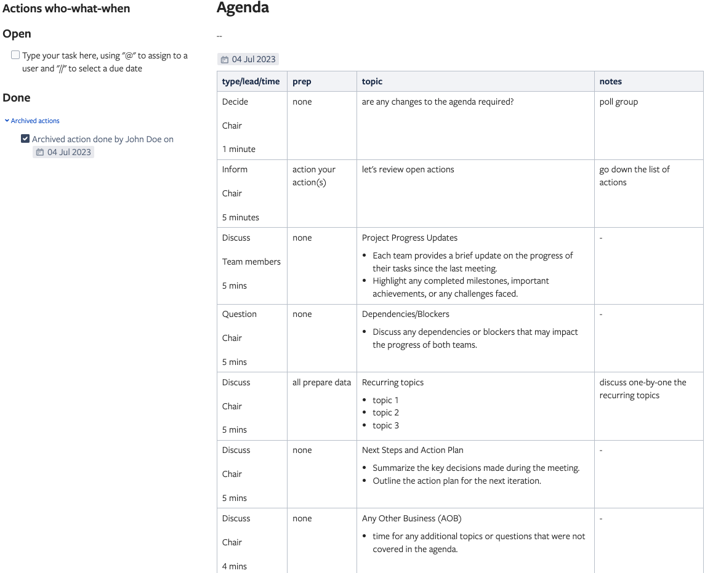

Facilitate the meeting with the following agenda:

1. Review of Action Items from Previous Meeting
   - Discuss any action items or tasks assigned during the previous meeting and check their status.

2. Project Progress Update
   - Each team provides a brief update on the progress of their tasks since the last meeting.
   - Highlight any completed milestones, important achievements, or any challenges faced.

3. Dependencies/Blockers
   - Discuss any dependencies or blockers that may impact the progress of both teams.

4. Next Steps and Action Plan
   - Summarize the key decisions made during the meeting.
   - Outline the action plan for the next iteration.

5. Any Other Business
   - time for any additional topics or questions that were not covered in the agenda.

## Example

## References

- Adapted from https://hbr.org/2015/03/how-to-design-an-agenda-for-an-effective-meeting.

