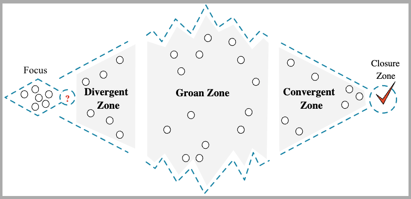

An Asynchronous Meeting is a particular [[Meeting Structure]] that does not require the attendee to be present at the same time. It is a very popular technique for Asynchronous Organization that have the focus on "not communicating in person". The advantages are to be more efficient in organizing our own and get more work done. The work could also result in being less boring.

## Definition

- What async meetings are?
    - Asynchronous Meetings are discussions about a **specific topic** that are held over a defined period of time, just like other meetings, but where the participants do not necessarily communicate in real-time.

- What async meetings are not?
    - Don't use async meetings for status update meetings or lean discussions meetings! Updates may be delivered differently, usually a text message is enough.

## Meeting Document

People participate in asynchronous meetings by sharing ideas via recorded voice, video, text, and other methods of asynchronous communication.

It is evident here, how having the right tools is fundamental for asynchronous meetings. So fundamental that sometimes discussion about async meetings only cover the different tools without covering the meeting execution.

To focus on meeting execution, and hence on how to run an asynchronous meeting the right way, I am doing a simplification here. I am going to consider a generic tool that is able to create word-like documents and allows to collaborate on them. Said in a very imprecise way, our asynchronous meeting will be executed by collaborating at the same shared document. This **meeting document** will represent the meeting itself.

Of course, when in implementing a real-life asynchronous meeting, we will use an advanced management tool that allows to comment the meeting document and track the status of the discussion (e.g. Jell, Slack, Zulip, Confluence, etc.). A very important feature here is to have notifications on new meeting edits/comments.

## The Presentation

The meeting document should include the meeting presentation. The presentation is the equivalent of the content presented during an in-person meeting.

- Trivial rule: everything should be recorded/written.
    - If you want to do a video presentation, then record your screen and/or cam and include the recording in the meting document.

### Presentation Content

The presentation content is the key to have a successful async meeting. It should have a clear outcome and, more important, it should **clearly highlight the issues that must be solved**.

For each issue, clearly state:
- What's the issue
- Why is it important
- What are the proposed solutions

No issue to solve? If the presentation don't provide any issue to solve, then an async meeting is not needed. It is just a status update.

## Meeting Structure

Like in-person meetings, also asynchronous meetings should have the same clear [[Meeting Structure]].

So, there are the three essential phases:

1. Presentation (the divergent zone)
    - Focus is essential at the beginning of the meeting.
        - Everyone should allocate some time to focus on the meeting document.
    - Common problem: you need to be sure everyone is updated about the meeting presentation.
        - Solution: engage participants from the start by tagging them in a message and ask them to acknowledge the meeting document, for example, by writing at least one comment stating that they watched the presentation.

2. Discussion (the groan zone)
    - Comments in the meeting document are accepted during this phase. Since the meeting is run async, participants add their contributions any time before a defined deadline.
    - Discuss all the comments and try to work out as many of them as possible.
    - Sometimes it is not convenient to solve comments asynchronously. In these case we may have small synchronous meetings to solve a specific issue:
        - Outline the unresolved issue,
        - Bring in people who need to be involved to help solve that issue,
        - Create a dedicate meeting to only meet about that,
        - Once that meeting concludes, update the meeting document.

3. Conclusion (the convergent zone)
    - Wrap it up! Once the contribution window closes, write the meeting conclusions in the meeting document itself and close it.
    - Ensure clear commitments and next steps are included in the meeting conclusions.
        - If during the meeting there were planned follow-up actions, this is a good moment to recap them.

## How to write a Meeting Document

Here is the [[Asynchronous Meeting Template]]. Usage Instructions:
- Replace placeholders with relevant information.
- Share the meeting document with your team using a collaborative tool.
- Track and notify participants of edits or comments.

## References

- [Running Asynchronous Meetings: The Right Way](https://www.youtube.com/watch?v=kNny-2wzfGM)
