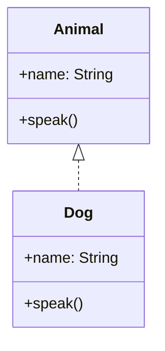

- Swift `extension`s can add fields, functions, and initializers to all the named types!
  - Swift **named types**:
    - `class`
    - `struct`
    - `enum`
    - `protocol`


## Protocol and Extensions

- The `extension`s have even more power with `protocol`s!
  - We can extend a named type so that it conforms to a protocol.
  - We can define a default method implementation for a protocol.


### Protocol default methods implementations

Consider this:



We can define a default implementation for `speak()` by defining an extension:

```swift
protocol Animal {
  var name: String { get }
  init(name: String)
  func speak()
}

extension Animal {
  func speak() {
    print("I'm an animal!")
  }
}
```

