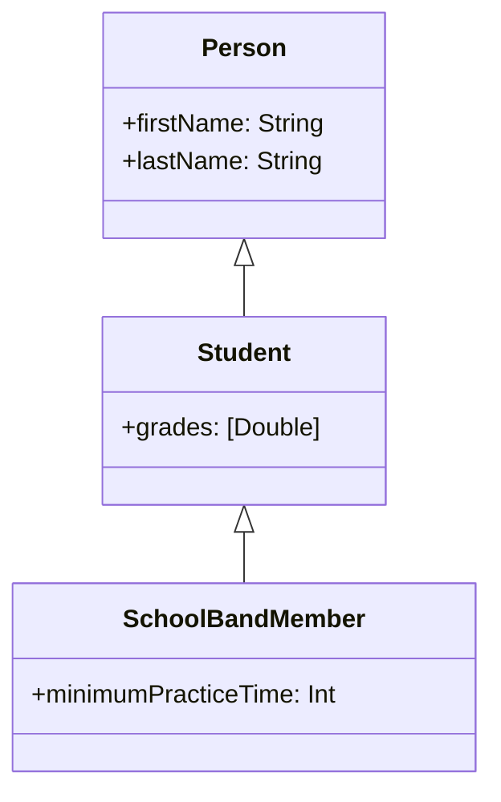

Consider the following hierarchy:



## Inheritance

Translates in Swift:

```swift
class Person {
  var firstName: String
  var lastName: String
  
  init(firstName: String, lastName: String) {
    self.firstName = firstName
    self.lastName = lastName
  }
}

class Student: Person {
  var grades: [Double] = []

  init(firstName: String, lastName: String, grades: [Double]) {
    self.grades = grades
    super.init(firstName, lastName)
  }
}

class SchoolBandMember: Student {
  var minimumPracticeTime = 2
}
```


(!) In swift a Class can only inherits from one Superclass

Definitions:
- Subclass: a Class that is inheriting form another Class (e.g. Student, SchoolBandMember)
- Superclass: a Class that has another Class inheriting from it  (e.g. Person, Student)
- Baseclass: a Class that is NOT inheriting from another class (e.g. Person). A Baseclass has no Superclass


### Class initialization

- Designated initializer: the one you implement
  - A deginated initializer must call the superclass designated initializer with `super.init()`
- Convenience initializer: is an initializer that calls another initalizer from the same class with `self.init()`.
  - A Convenience initializer has the `convenience` keyword.
  - Ultimately, the chain of conveniente initializers must call the designated initializer from the same class.

- Two-phases initialization
  - **Phase 1**. initialize the stored properties.
    - call `super.init()` to continue Phase 1 for superclasses
  - **Phase 2**. `self` is now ready and you can access its methods.

- `required`
  - A `required init()` methods requires it to be implemented in all subclasses.

## Polymorphism

Instantiate some objects:

```swift
let alice = Person(firstName: "Alice", lastName: "Red")
let bob = Student(firstName: "Bob", lastName: "White")
let carl = SchoolBandMember(firstName: "Carl", lastName: "Black")
```

Polymorphism: in Swift it is possible to cast from a subclass to a superclass and vice-versa.

Upcasting:
```swift
let student = carl as Student
```

Forced Downcasting:
```swift
let bandMember = student as! SchoolBandMember
```

The above downcasting may produce errors. We may do it in a safe way:

Conditional Downcasting operator:
```swift
if let bandMember = student as? SchoolBandMember {
  print("Student is a SchoolBandMember")
} else {
  print("Student is a NOT SchoolBandMember")
}
```
Alternative: use a switch statement.


